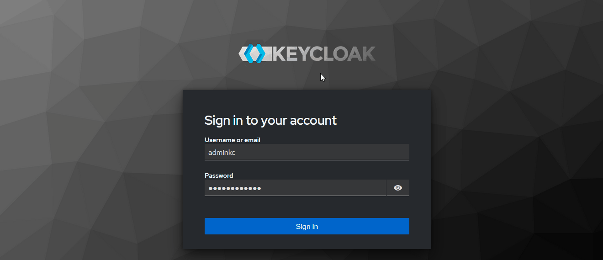
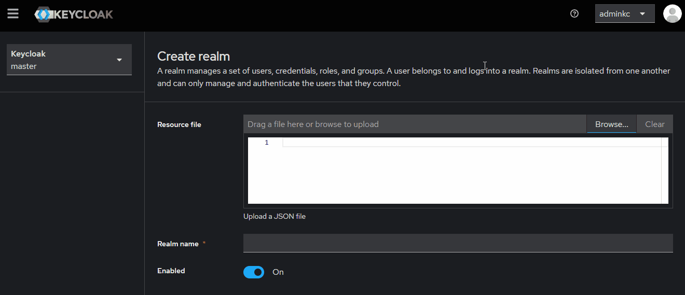
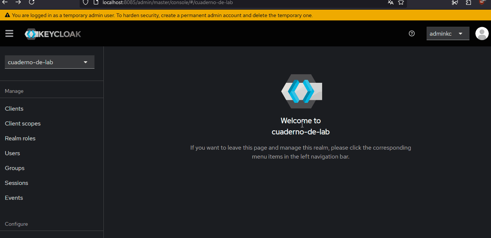

# Cuaderno de Laboratorio - Guía de Inicio Rápido - Frontend

## **Requisitos previos**

1. **Node.js** (versión < 18)  
   Descárgalo desde [Node.js Official Website](https://nodejs.org/).

2. **MongoDB**  
   Instálalo siguiendo las instrucciones en [MongoDB Official Website](https://www.mongodb.com/).

3. **Docker y Docker Compose**  
   Instálalos desde [Docker Official Website](https://www.docker.com/).

---

## **Pasos para el despliegue**

### 1. Clonar el repositorio del Frontend

Navegar al directorio donde va a estar el frontend y ejecutar el comando:

```bash
git clone https://github.com/DesApp-2024c1-Grupo-3/cuaderno-de-laboratorio-front.git
```

### 2. Cambiar a rama dev

En el directorio raíz donde está el frontend ejecutar el comando:

```bash
git checkout dev
```

### 3. Instalar dependencias

En el directorio raíz donde está el frontend ejecutar el comando:

```bash
npm install
```

### 4. Configurar archivo de variables de ambiente

En la raíz del directorio donde está el frontend, localizar el archivo `.env.example` y renombrarlo a `.env`

### 5. Iniciar Docker-Compose

Con el motor de docker corriendo, en el directorio raíz donde está el frontend ejecutar el comando:

```bash
docker-compose up -d
```

### 6. Configuración de Keycloak (primera vez que se inicia el proyecto)

#### Acceder a Keycloak a través de [http://localhost:8085](http://localhost:8085)

Ingresar al sistema con las siguientes credenciales:

Usuario: _adminkc_

Contraseña: _K3ycl04k321!_

#### Crear un nuevo reino en Keycloak

Una vez dentro de Keycloak, crear un nuevo reino (Realm).



#### Importar la configuración del archivo realm-export.json:

Dirigirse a Resource file y seleccionar el archivo [Imports_Keycloak/realm-export.json](https://raw.githubusercontent.com/DesApp-2024c1-Grupo-3/cuaderno-de-laboratorio-front/refs/heads/dev/Imports_Keycloak/realm-export.json)

<!-- Ver si el link anterior sirve para futuras actualizaciones del repo -->

Crear el reino con la configuración importada



#### Importar usuarios a Keycloak

Navegar a la configuración del reino

Ir a **Acciones -> Partial Import** y seleccionar el archivo [Imports_Keycloak/cuaderno-de-lab-users-0.json](https://raw.githubusercontent.com/DesApp-2024c1-Grupo-3/cuaderno-de-laboratorio-front/refs/heads/dev/Imports_Keycloak/cuaderno-de-lab-users-0.json)

<!-- Ver si el link anterior sirve para futuras actualizaciones del repo -->

Seleccionar el **checkbox** de los usuarios

Importar



### 7. Iniciar el frontend

En el directorio raíz donde está el frontend ejecutar el comando:

```bash
npm start
```

---

## **Usuarios**

Contamos con un total de 2 profesores y 30 alumnos.

Los alumnos tienen ID autoincrementales a partir del 10000000.

Todos los usuarios tienen la misma contraseña.

| Tipo de usuario | Usuario  | Contraseña |
| --------------- | -------- | ---------- |
| Profesor        | 12345678 | 1234       |
| Profesor        | 87654321 | 1234       |
| Alumno          | 10000000 | 1234       |
| Alumno          | 10000001 | 1234       |
| Alumno          | 10000002 | 1234       |
| Alumno          | 10000003 | 1234       |
| Alumno          | 10000004 | 1234       |
| Alumno          | 10000005 | 1234       |
| Alumno          | 10000006 | 1234       |
| Alumno          | 10000007 | 1234       |
| Alumno          | 10000008 | 1234       |
| Alumno          | 10000009 | 1234       |
| Alumno          | 10000010 | 1234       |
| Alumno          | 10000011 | 1234       |
| Alumno          | 10000012 | 1234       |
| Alumno          | 10000013 | 1234       |
| Alumno          | 10000014 | 1234       |
| Alumno          | 10000015 | 1234       |
| Alumno          | 10000016 | 1234       |
| Alumno          | 10000017 | 1234       |
| Alumno          | 10000018 | 1234       |
| Alumno          | 10000019 | 1234       |
| Alumno          | 10000020 | 1234       |
| Alumno          | 10000021 | 1234       |
| Alumno          | 10000022 | 1234       |
| Alumno          | 10000023 | 1234       |
| Alumno          | 10000024 | 1234       |
| Alumno          | 10000025 | 1234       |
| Alumno          | 10000026 | 1234       |
| Alumno          | 10000027 | 1234       |
| Alumno          | 10000028 | 1234       |
| Alumno          | 10000029 | 1234       |
