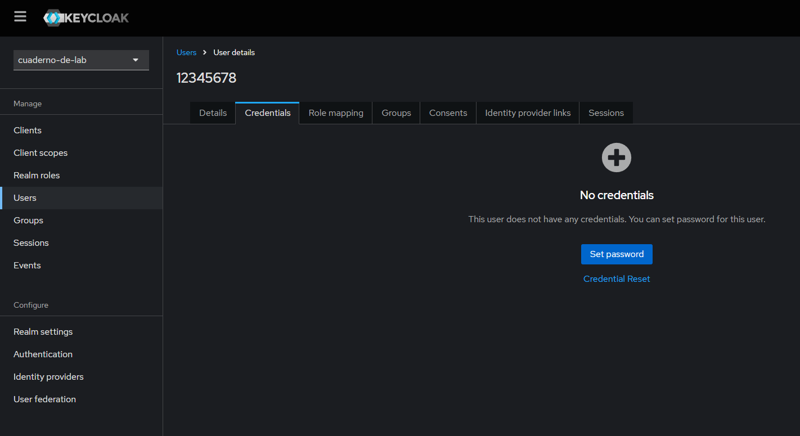
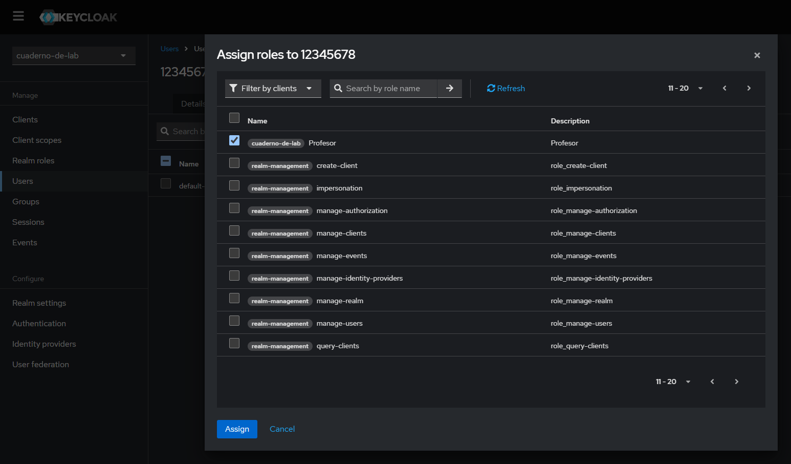
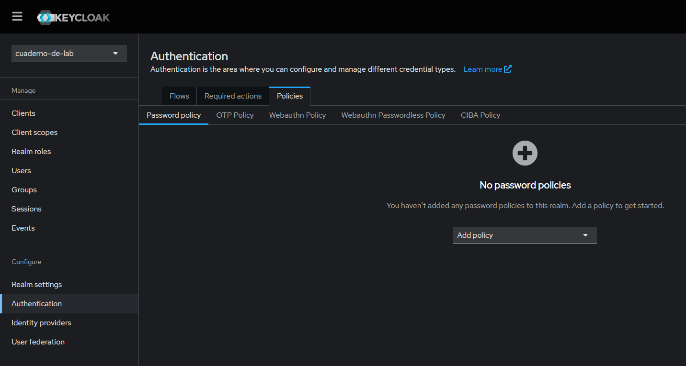

# Cuaderno de Laboratorio - Guía de Inicio Rápido - Frontend

## **Requisitos previos**

1. **Node.js** (versión < 18)  
   Descárgalo desde [Node.js Official Website](https://nodejs.org/).

2. **Docker y Docker Compose**  
   Instálalos desde [Docker Official Website](https://www.docker.com/).

---

## **Pasos para el despliegue**

### 1. Clonar el repositorio del Frontend

Navegar al directorio donde va a estar el frontend y ejecutar el comando:

```bash
git clone https://github.com/DesApp-2024c1-Grupo-3/cuaderno-de-laboratorio-front.git
```

### 2. Cambiar a rama dev

En el directorio raíz donde está el frontend ejecutar el comando:

```bash
git checkout dev
```

### 3. Instalar dependencias

En el directorio raíz donde está el frontend ejecutar el comando:

```bash
npm install
```

### 4. Configurar archivo de variables de ambiente

En el directorio raíz donde está el frontend ejecutar el comando:

```bash
cp .env.example .env
```

### 5. Iniciar Docker-Compose

Con el motor de docker corriendo, en el directorio raíz donde está el frontend ejecutar el comando:

```bash
docker-compose up -d
```

### 6. Configuración de Keycloak (primera vez que se inicia el docker o si se elimina el volumen del mismo)

#### Acceder a Keycloak a través de [http://localhost:8085](http://localhost:8085)

Ingresar al sistema con las siguientes credenciales:

Usuario: _adminkc_

Contraseña: _K3ycl04k321!_

#### Ingresar al reino en Keycloak

Una vez dentro de Keycloak, ingresar al reino.


#### Importar usuarios a Keycloak (Dentro del realm cuaderno-de-lab)

Navegar a la configuración del reino

Ir a **Acciones -> Partial Import** y seleccionar el archivo [Imports_Keycloak/cuaderno-de-lab-users-0.json](https://raw.githubusercontent.com/DesApp-2024c1-Grupo-3/cuaderno-de-laboratorio-front/refs/heads/dev/Imports_Keycloak/cuaderno-de-lab-users-0.json)

<!-- Ver si el link anterior sirve para futuras actualizaciones del repo -->

Seleccionar el **checkbox** de los usuarios

Importar


### 7. Iniciar el frontend

En el directorio raíz donde está el frontend ejecutar el comando:

```bash
npm start
```

---

## **Usuarios**

Contamos con un total de 2 profesores y 30 alumnos.

Los alumnos tienen ID incrementales a partir del 10000000.

Todos los usuarios tienen la misma contraseña.

| Tipo de usuario | Usuario  | Contraseña |
| --------------- | -------- | ---------- |
| Profesor        | 12345678 | 1234       |
| Profesor        | 87654321 | 1234       |
| Alumno          | 10000000 | 1234       |
| Alumno          | 10000001 | 1234       |
| Alumno          | 10000002 | 1234       |
| Alumno          | 10000003 | 1234       |
| ...             | ...      | ...        |
| Alumno          | 10000028 | 1234       |
| Alumno          | 10000029 | 1234       |

### Crear usuario nuevo en keycloak

#### Ingresar al reino en Keycloak

Una vez dentro de Keycloak, ingresar al reino (Realm).


#### Crear un nuevo usuario

- En el menú lateral, selecciona la opción **Users**.

- Haz clic en el botón **Add User**.

- Completa los campos básicos, como:

  - **Username**: Nombre único obligatorio.
  - **Email**: Opcional, pero útil para autenticación o notificaciones.
  - **First name**: Nombre, opcional para más contexto.
  - **Last name**: Apellido, opcional para más contexto.

- Haz clic en **Create** para crear el usuario.


#### Configurar credenciales

- Ve a la pestaña **Credentials**.

- Haz clic en el botón **Set password**.



- Configure una contraseña para el usuario:

  - Ingrese la contraseña.
  - Marca la opción **Temporary** si quieres que el usuario deba cambiarla al iniciar sesión.
  - Haga clic en **Save**.


#### Asignar roles o grupos (opcional)

- Desde la pestaña **Role mapping** o **Groups** , puedes asignar permisos o agrupar al usuario.



#### Generación de roles

- Ir a la pestaña **Realm roles**.

- Haz clic en el botón **Create role**.


- Configure los campos del rol:
  - **Role name**: Nombre único obligatorio.
  - **Description**: Opcional, descripción del rol.


#### Establecer política de passwords

- Ir a la pestaña **Authentification**.

- Ir a la pestaña **Policies**.

- Ir a la pestaña **Password policy**.

- Haz clic en el desplegable **Add policy**.

- Definir y configurar las políticas a aplicar.



**_Ejemplo_**

Se ha establecido una longitud para las claves de 12 caracteres, al menos 1 mayúscula, 1 minúscula, un dígito numérico y un carácter especial.


#### Login de usuario

El usuario tiene permitido loguearse con su dni o su mail asociado.


Cuando el usuario ingresa, debido a que marcamos como “Temporal” su password, debe cambiarlo y le aparece la siguiente pestaña:


Al poner un password que no cumple con la política establecida, se le indica mediante un mensaje informativo cual es el motivo por el cual debe mejorar los datos ingresados (ver la próxima sección de configuración de política de passwords)


---

## **Tema personalizado Keycloak**

### Funcionamiento

Al momento de ejecutar `docker-compose up -d` además de crearse los contenedores, al contenedor de _Keycloak_ se le copia en la carpeta de temas la carpeta `Imports_Keycloak\Tema_UNAHUR` (actualmente es una copia del tema keycloak.v2) y se importa y crea el reino **cuaderno-de-lab**.

### Selección de tema

- Una vez dentro de Keycloak, ingresar al reino (Realm).


- Ir a la pestaña **Realm settings**.

- Ir a la pestaña **Themes**.

- Haz clic en el desplegable **Select login theme**.

- Seleccionar tema

- Haz clic en el botón **Save**.


### Modificación del tema_UNAHUR

Keycloak utiliza **FreeMarker**, un motor de plantillas basado en Java, para renderizar sus temas.
Los temas en Keycloak están compuestos por archivos `.ftl` (archivos de plantilla de FreeMarker) que definen la estructura HTML.

Para modificar el tema del login se debe modificar los archivos `Imports_Keycloak\Tema_UNAHUR\login\login.ftl` y `Imports_Keycloak\Tema_UNAHUR\login\resources\css\styles.css` (y los que sean necesarios).

Una vez modificados se deben de **actualizar en el container**, para ello, con el **container corriendo**:

1. identificar el contenedor

```bash
docker ps
```

2. eliminar carpeta del contenedor:

```bash
docker exec -u root <ContainerID> rm -rf opt/keycloak/themes/Tema_UNAHUR/
```

3. Copia la carpeta actualizada al contenedor:

   **_Este comando necesita la ruta absoluta_**

```bash
docker cp <RutaAbsoluta>\cuaderno-de-laboratorio-front\Imports_Keycloak\Tema_UNAHUR <ContainerID>:/opt/keycloak/themes/Tema_UNAHUR
```

4. Reiniciar el container:

```bash
docker restart <ContainerID>
```

### Selección de tema por defecto

Si deseas configurar un tema específico por defecto para un realm y evitar que se pueda cambiar desde la interfaz, edita el archivo `Imports_Keycloak\realm-export.json` y en la línea **722** agrega `"login_theme": "<TemaSeleccionado>"`.
Para que actualice este parámetro, se debe de **BORRAR CONTENEDOR Y VOLUMEN** de docker, y volver a levantarlos.

EJ: `"login_theme": "Tema_UNAHUR"`.

### Documentación de respaldo

#### Creación de temas en Keycloak:

- Aprende cómo crear y personalizar temas en Keycloak con la guía oficial:

[https://www.keycloak.org/docs/26.0.0/server_development/#\_themes](https://www.keycloak.org/docs/26.0.0/server_development/#_themes)

#### Página oficial de FreeMarker:

- Para comprender más sobre el lenguaje de plantillas FreeMarker y sus capacidades, visita:

[https://freemarker.apache.org/](https://freemarker.apache.org/)
